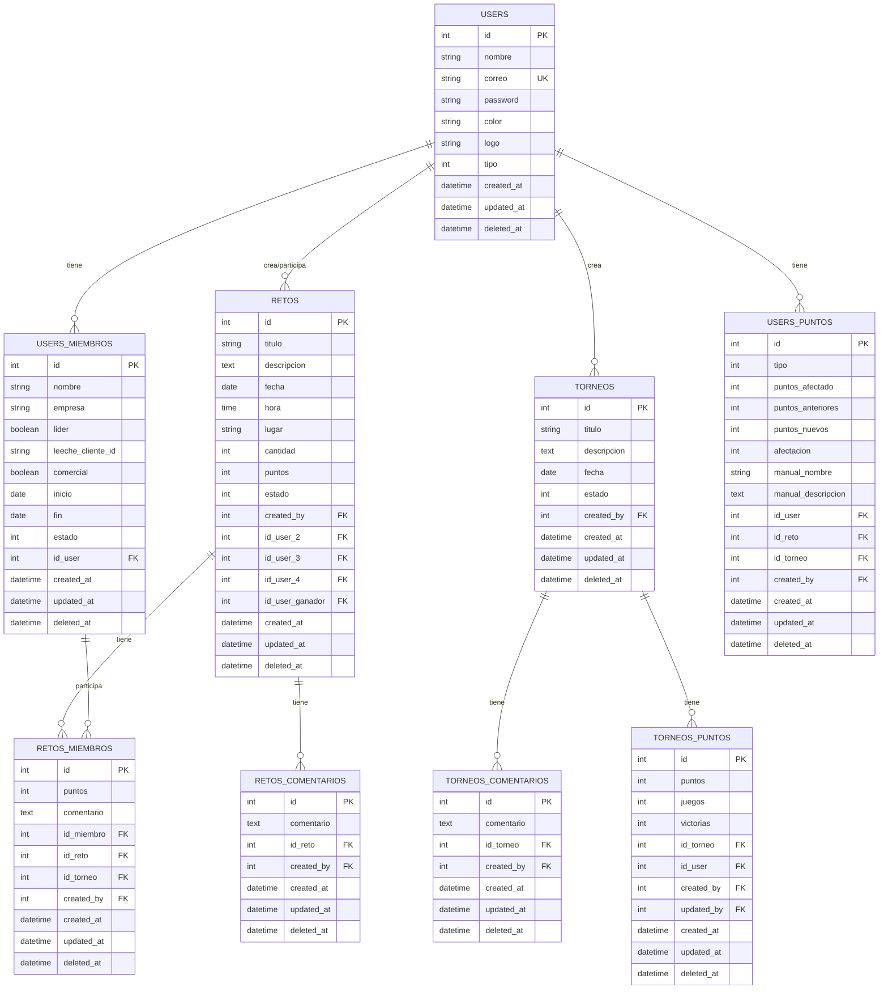

# Hunters Campus (Backend)

Con el objetivo de retomar el proyecto y dotarlo de escalabilidad. A continuación, se describen los aspectos clave del sistema, incluyendo estructura de la base de datos, migraciones, autenticación, endpoints de la API, comandos de desarrollo, pendientes y recomendaciones.

---

## 1. Migraciones Implementadas

Las migraciones se encuentran en el directorio `database/migrations/` y se estructuran de la siguiente manera:

1. **create_users_table.php**
    
    Crea la tabla de usuarios:
    
    ```php
    Schema::create('users', function (Blueprint $table) {
        $table->id();
        $table->string('nombre');
        $table->string('correo')->unique();
        $table->string('password');
        $table->string('color')->nullable();
        $table->string('logo')->nullable();
        $table->tinyInteger('tipo')->default(1);
        $table->timestamps();
        $table->softDeletes();
    });
    
    ```
    
2. **create_retos_table.php**
    
    Define la tabla de retos:
    
    ```php
    Schema::create('retos', function (Blueprint $table) {
        $table->id();
        $table->string('titulo', 60);
        $table->text('descripcion');
        $table->date('fecha');
        $table->time('hora');
        $table->string('lugar', 40);
        $table->integer('cantidad');
        $table->integer('puntos');
        $table->tinyInteger('estado')->default(1);
        // Llaves foráneas
        $table->foreignId('created_by')->constrained('users');
        $table->foreignId('id_user_2')->nullable()->constrained('users');
        $table->foreignId('id_user_3')->nullable()->constrained('users');
        $table->foreignId('id_user_4')->nullable()->constrained('users');
        $table->timestamps();
        $table->softDeletes();
    });
    
    ```
    
3. **create_torneos_table.php**
4. **create_users_miembros_table.php**
5. **create_users_puntos_table.php**
6. **create_retos_miembros_table.php**
7. **create_retos_comentarios_table.php**
8. **create_torneos_comentarios_table.php**
9. **create_torneos_puntos_table.php**

---

## 2. Seeders Implementados

Los seeders se encuentran en el directorio `database/seeds/` y siguen la estructura de Laravel < 8.0:

1. **DatabaseSeeder.php**
    
    Seeder principal que orquesta la ejecución de los siguientes seeders:
    
    ```php
    class DatabaseSeeder extends Seeder
    {
        public function run()
        {
            $this->call([
                UsersTableSeeder::class,
                UsersMiembrosTableSeeder::class,
                RetosTableSeeder::class,
                TorneosTableSeeder::class,
                // ...otros seeders
            ]);
        }
    }
    
    ```
    
2. **UsersTableSeeder.php**
    - Crea el usuario admin y las tribus iniciales.
    - Establece correos y contraseñas de prueba.
3. **UsersMiembrosTableSeeder.php**
    - Genera miembros para cada tribu, asignando líderes y miembros regulares.
4. **RetosTableSeeder.php**
    - Genera retos de prueba y asigna participantes y estados aleatorios.
5. **TorneosTableSeeder.php**
    - Crea torneos de ejemplo con fechas y descripciones definidas.
6. **UsersPuntosTableSeeder.php**
    - Simula puntuaciones históricas y la participación en retos y torneos.
7. **RetosMiembrosTableSeeder.php**
8. **RetosComentariosTableSeeder.php**
9. **TorneosComentariosTableSeeder.php**
10. **TorneosPuntosTableSeeder.php**

---

## 3. Estructura de la Base de Datos

### 3.1 Relaciones Principales

- **Users** → **Users_Miembros**: 1:N
- **Users** → **Retos**: 1:N
- **Users** → **Torneos**: 1:N
- **Users** → **Users_Puntos**: 1:N
- **Retos** → **Retos_Comentarios**: 1:N
- **Torneos** → **Torneos_Comentarios**: 1:N
- **Users_Miembros** → **Retos_Miembros**: 1:N

### 3.2 Diagrama ER

https://claude.site/artifacts/69d6a17e-4789-4f01-aa82-3818290daa4a 



[er-diagram.mermaid](attachment:74a52da7-a6e7-467f-bbd6-7b1b09724d3e:er-diagram.mermaid)

---

## 4. Sistema de Autenticación

### 4.1 Implementación JWT en el Backend

El backend cuenta con un sistema de autenticación basado en JWT (`tymon/jwt-auth`), permitiendo el manejo de sesiones seguras. Se configura en `.env` mediante `JWT_SECRET`.

### 4.2 Limitaciones en el Frontend

A pesar de que JWT está implementado en el backend, **no se está utilizando en el frontend**. En su lugar, el frontend solicita una contraseña al usuario cuando se requiere realizar cambios como agregar un torneo. Esta contraseña se compara directamente con cualquier registro en la base de datos sin ningún tipo de hash o encriptación, lo que representa un problema de seguridad significativo.

### 4.3 Endpoints de Autenticación

- **Login con correo:**
    
    ```
    POST /api/auth/login
    Content-Type: application/json
    {
        "correo": "admin@campus.com",
        "password": "admin123"
    }
    ```
    
- **Pedir contraseña (Verificacion que se usa en el fronend):**
    
    ```
    POST /api/auth/pedir-password
    Content-Type: application/json
    {
        "password": "alpha123"
    }
    ```
    

```
POST /api/auth/login       # Autenticación con correo y password
POST /api/auth/pedir-password  # Verificación mediante password

```

### 4.2 Códigos de Estado

- **200:** Éxito
- **400:** Credenciales inválidas
- **401:** No autorizado
- **500:** Error del servidor

---

## 5. Comandos de Desarrollo

### 5.1 Instalación Inicial

```bash
composer install
php artisan key:generate
php artisan jwt:secret

```

### 5.2 Gestión de la Base de Datos

```bash
php artisan migrate          # Ejecuta las migraciones
php artisan migrate:fresh    # Recrea la base de datos desde cero
php artisan db:seed          # Pobla la base de datos con datos de prueba
composer dump-autoload       # Actualiza el autoloader

```

---

## 6. Pendientes de Implementación

1. Integrar carga de archivos a S3.
2. Optimizar Manejo del ORM agregando las relaciones en los modelos
3. Implementar un JWT seguro desde el fronent y en todas las rutas excepto el login y register
4. Documentar endpoints adicionales.


---


# Informe de Despliegue: Aplicación Laravel en Heroku

## 1. Configuración Inicial
- Se verificó la versión de Laravel (Laravel 7)
- Se configuró el entorno local para trabajar con PHP 8.1
- Se aseguró la existencia de los archivos necesarios como `Procfile` y configuraciones de base de datos

## 2. Preparación del Proyecto
Se realizaron los siguientes ajustes:

### 2.1 Configuración de Composer
Se modificó el `composer.json` para soportar PHP 8.1:
```json
{
    "require": {
        "php": "^7.4|^8.0|^8.1",
        "laravel/framework": "^8.83"
    }
}
```

### 2.2 Configuración de Heroku
Se configuró el buildpack de PHP:
```bash
heroku buildpacks:set heroku/php
```

### 2.3 Configuración de Base de Datos
Se establecieron las variables de entorno en Heroku para la conexión con Railway:
- DB_CONNECTION: mysql
- DB_HOST: yamabiko.proxy.rlwy.net
- DB_PORT: 54493
- DB_DATABASE: railway
- DB_USERNAME: root
- DB_PASSWORD: [contraseña segura]

## 3. Proceso de Despliegue

### 3.1 Comandos de Git
```bash
git add .
git commit -m "Preparación para despliegue en Heroku"
git push heroku main
```

### 3.2 Configuración de Variables de Entorno
Se configuraron las variables necesarias en Heroku:
```bash
heroku config:set APP_NAME=Laravel
heroku config:set APP_ENV=production
heroku config:set APP_KEY=[key-generada]
heroku config:set APP_DEBUG=false
```

### 3.3 Configuración del AppServiceProvider
Se modificó para soportar la configuración regional y la longitud de cadenas en la base de datos:
```php
use Illuminate\Support\Facades\Schema;
use Carbon\Carbon;

public function boot()
{
    Carbon::setlocale('es');
    setlocale(LC_TIME, 'es_ES.utf8');
    Schema::defaultStringLength(191);
}
```

## 4. Solución de Problemas

### 4.1 Problemas Resueltos
- Error de autenticación con Git: Se solucionó mediante reconfiguración de credenciales
- Problemas de compatibilidad PHP: Se ajustó la versión en el `composer.json`
- Error de acceso a base de datos: Se corrigió la contraseña en las variables de entorno

### 4.2 Configuraciones Adicionales
- Se añadió soporte para HTTPS
- Se configuró el manejo de archivos estáticos
- Se estableció el modo de producción

## 5. Resultado Final
- La aplicación se desplegó exitosamente en: https://hunters-back-e4fc0bfa2341.herokuapp.com/
- Se verificó el funcionamiento de las APIs
- Se comprobó la conexión con la base de datos

## 6. Recomendaciones
- Mantener respaldo regular de la base de datos
- Monitorear el uso de recursos en Heroku
- Mantener actualizadas las dependencias del proyecto
- Verificar regularmente los logs para detectar posibles errores

## 7. Próximos Pasos
- Implementar sistema de monitoreo
- Optimizar consultas de base de datos
- Configurar sistema de caché
- Implementar pruebas automatizadas
